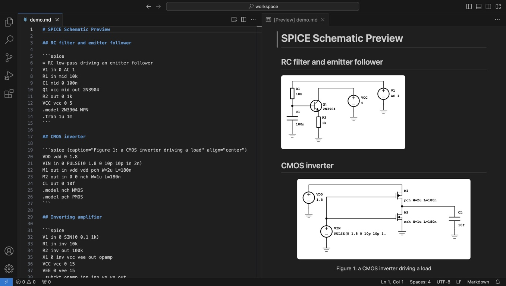
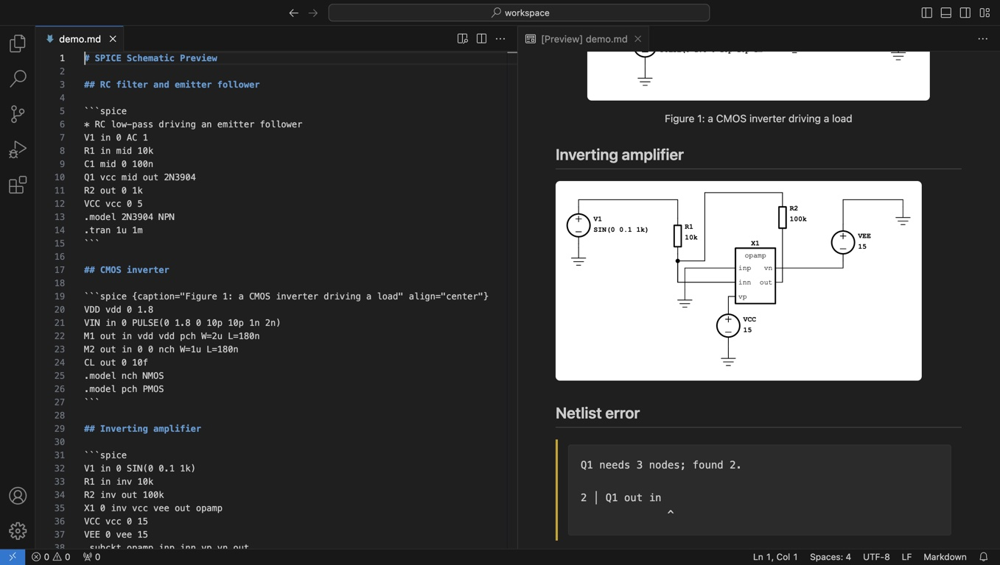

# SPICE Schematic Preview

Draws SPICE netlists as circuit schematics in VS Code's built-in Markdown preview.
It draws; it never simulates.

Write a netlist in a fence tagged `spice`:

````markdown
```spice
* RC low-pass driving an emitter follower
V1 in 0 AC 1
R1 in mid 10k
C1 mid 0 100n
Q1 vcc mid out 2N3904
R2 out 0 1k
VCC vcc 0 5
.model 2N3904 NPN
```
````



Only `spice` fences are claimed — `cir`, `ngspice` and other fences are left to
other renderers. Placement and wiring are automatic; the netlist says what is
connected, not where it goes.

## What is drawn

| Element | Drawn as |
| --- | --- |
| `R`, `C`, `L` | Resistor, capacitor, inductor, with the value |
| `D` | Diode, with its model |
| `V`, `I` | Source: + and − marks, or an arrow from n+ to n− |
| `Q` | NPN or PNP by its `.model`, with the model name |
| `M` | NMOS or PMOS by its `.model`; body drawn if not the source |
| `X` | A box titled with the subcircuit, pins named from its `.subckt` |
| `B` `E` `F` `G` `H` `J` `O` `S` `T` `W` `Z` | A box titled with what it is |

Every connection to ground (`0` or `gnd`) gets its own ground symbol. Node names
are case-insensitive, as in SPICE. `+` continuation lines and `*`, `;`, `$` and
`//` comments work as in ngspice. Analysis directives such as `.tran` are
skipped, as are `.subckt` bodies and `.control` blocks; nothing after `.end` is
read.

The first line of a SPICE file is its title; in a fence, start it with `*` to
make it a comment.

A few things are noted in the *SPICE Schematic Preview* output channel rather
than shown: a transistor whose model is not defined (drawn as NPN or NMOS), a
subcircuit that is not defined (pins numbered), a bipolar substrate node, and
`K` coupling.

## Included files

`.include`, `.inc` and `.lib` read files, as SPICE does, so a model library can
decide which transistors are PNP and name a subcircuit's pins, and a fence can
draw a circuit kept in its own file:

````markdown
```spice
.include "models/opamps.lib"
.lib corners.lib tt
X1 inp inn vcc vee out LM358
```
````

`.lib file section` reads one section; `.lib file` alone reads the whole file,
as in LTspice. Includes may nest. Elements in included files are drawn; an error
inside one is shown at the fence's include, naming the file and line.

Files are read only when all of these hold; otherwise the schematic draws
without them and the output channel says why:

- the workspace is trusted;
- the Markdown document is saved inside a local workspace folder;
- the path is relative to the Markdown document and stays inside that folder,
  through no symlink.

A file may be 8 MB; a fence may include 32 files and 16 MB in all. Saved
changes to an included file redraw the schematics that use it, and **SPICE:
Refresh Included Files** rereads everything. Only text is read, and only names
and elements are taken from it; nothing is run.

## Fence attributes

An optional attribute block after the tag adjusts how one schematic is presented:

````markdown
```spice {alt="A CMOS inverter" caption="Figure 1: CMOS inverter" align="center"}
M1 out in vdd vdd pch
M2 out in 0 0 nch
.model nch NMOS
.model pch PMOS
```
````

| Attribute | Effect |
| --- | --- |
| `alt` | Description for readers who cannot see the schematic |
| `caption` | Text shown beneath the schematic |
| `align` | `left`, `center` or `right` |
| `class` | Extra CSS class on the schematic's `<svg>` |

Values are quoted. A mistyped or malformed attribute never costs you the
schematic: it is ignored, and a note is written to the output channel.



## Errors and limits

A netlist error is shown in place of the schematic, quoting the line with a caret
under the column. A netlist may have up to 400 elements and 64 KB. Layout is
limited by the `spice.layoutTimeout` setting (seconds, 0.5 to 60, default 3); a
circuit that takes longer shows a timeout message until it changes, and a change
to the setting retries it. Densely connected circuits of a few hundred parts can
need more than the default.

Schematics are drawn on a white card in every theme. In Restricted Mode and
virtual workspaces everything works except reading included files.

## Development

Requires Node 22 or newer (see `.nvmrc`).

```sh
npm ci
npm run lint            # tsc --noEmit
npm test                # node --test, after building
npm run package         # vsce package
npm run test:package    # the VSIX inside a real VS Code
npm run screenshots     # regenerate media/screenshots from examples/demo.md
```

Symbols live in `src/skin/symbols.svg`; `test/schematic.test.ts` traces every
wire of a set of reference circuits and fails if a drawing connects the wrong
pins.

The netlist parsers in `vendor/parsers/` are generated and committed; rebuilding
them needs flex, Bison and Emscripten and is described in `dev.md`.

## License

MIT for this extension. Bundled elkjs is EPL-2.0; symbols and layout code are
adapted from netlistsvg (MIT) — see [THIRD_PARTY_NOTICES.md](THIRD_PARTY_NOTICES.md).
